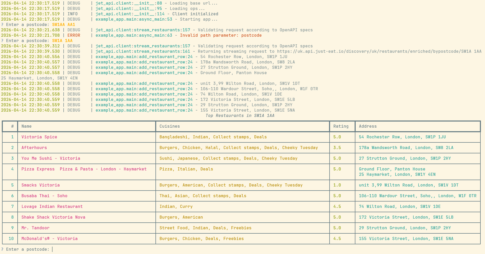

# jet_ec_assignment
Early careers software engineering program complete at home coding assignment

A simple application that queries postcodes using the JET UK API and returns the 10 latest restaurants

## Getting Started

### Installing & running example_app

#### Using Docker
The Docker images are public for easy execution:
```bash
docker run -it --rm ghcr.io/leckerensirupwaffeln/jet_ec_assignment/example_app:latest
```

#### Using uv
```bash
uv run example_app
```

#### Using python3 and pip
```bash
python3 -m venv .venv
source .venv/bin/activate
pip install -r requirements.txt
python3 apps/example_app/src/example_app/main.py
```

#### Using .whl, python3, and .pip
```bash
python3 -m venv .venv
source .venv/bin/activate
pip install <path_to_wheel_file>
example_app
```

### Developement

The project uses `just` to automate common development tasks:

* **Running tests:**
  `uv run just test`

* **Running linter:**
  `uv run just lint`

* **Running static analysis:**
  `uv run just typecheck`

* **Building docs:**
  `uv run just build-docs`

## Features

* Python 3.12
* uv package & project manager (monorepo with multiple workspaces)
* GitHub Actions workflows
    * **Generate models workflow**
        * Automatically generates Pydantic models from an OpenAPI spec on changes
    * **CI workflow**
        * **Uses tox environments to perform:**
            * Linting using ruff
            * Type-checking using mypy
            * Testing using pytest
* **Release workflow**
    * Releases on push to main or on git tags
    * Only releases on succesful CI runs
    * Releases packages to GitHub and also Docker images to GHCR
* jet_api library seperated from example_app
* Pydantic validation
* Asynchronous httpx + ijson streaming
* Auto-documentation with Zemsical & mkdocstrings (available at `/docs/site`)
* Use of OpenAPI as only source-of-truth

## Assumptions & improvements

### Assumptions
* It is assumed the user needs to input the postcode manually via the CLI

### Improvements
* **Enhanced testing:** Add Unit, integration, E2E, and performance test suites (currently none)
* **Extended documentation:** Increase docstring coverage
* **UI polish:** Add user rating counts next to the star ratings in the CLI output of example_app

## Interface

The application example_app runs as a standard console interface:


